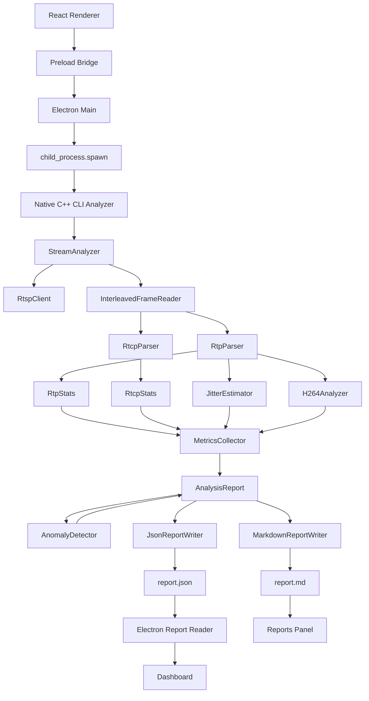
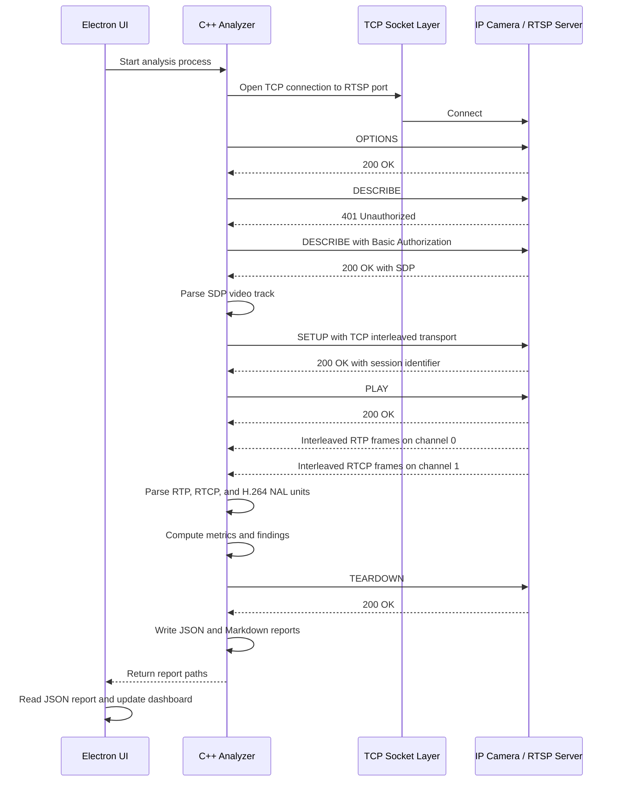
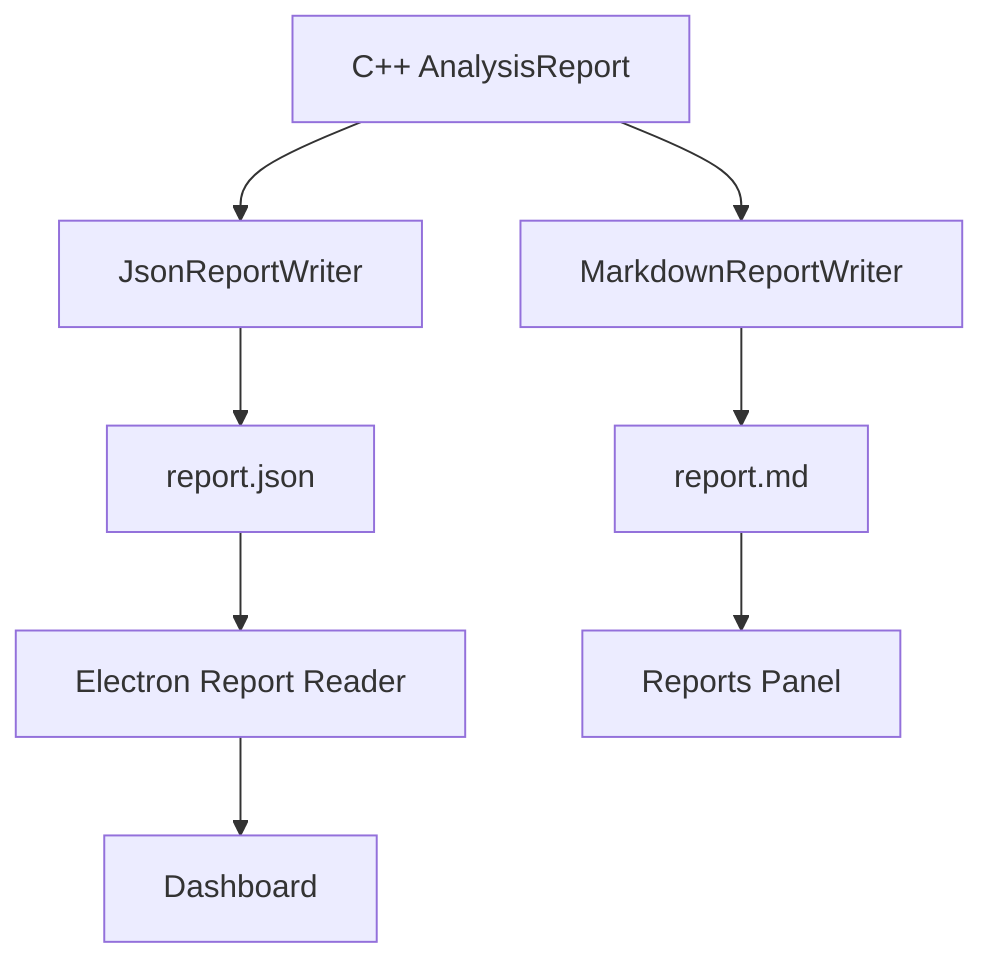

# Architecture

RTSP Stream Inspector is a hybrid desktop/native application. The Electron frontend owns the user workflow, configuration, live log display, and report presentation. The C++20 backend owns protocol I/O, stream parsing, metrics collection, findings, and report generation.

The design intentionally keeps the protocol analyzer outside the renderer process. Electron starts the native CLI as a controlled child process and consumes structured output through generated report files.

## 1. System Architecture



The C++ analyzer produces the report contract. Electron is not responsible for interpreting raw RTP, RTCP, or H.264 bytes.

## 2. Electron / C++ Process Boundary

Electron launches the native analyzer as a controlled child process through `child_process.spawn`. The frontend passes validated command-line arguments such as the RTSP URL, timeout, frame count, packet log limit, output directory, report options, and native binary path.

The process boundary has several advantages:

- the protocol analyzer remains a normal C++ CLI executable;
- the UI can stream stdout/stderr as live logs;
- JSON and Markdown reports remain reproducible artifacts;
- the renderer does not need direct native bindings;
- the architecture is easy to debug outside Electron.

This is intentionally a process-and-report architecture. Native Node-API or a structured IPC bridge may be considered later, but it is not required for the current project.

## 3. Native Engine Architecture

The backend is organized around a stream analysis pipeline:

1. parse the RTSP URL and remove inline credentials from request URIs;
2. establish a TCP connection to the RTSP server;
3. execute the RTSP control sequence;
4. parse SDP and select the H.264 video track;
5. request TCP interleaved transport;
6. read interleaved RTP/RTCP frames;
7. parse RTP, RTCP, and H.264 NAL structure;
8. collect timing and bitrate metrics;
9. build an `AnalysisReport`;
10. run `AnomalyDetector`;
11. write JSON and Markdown reports;
12. send TEARDOWN when possible.

The analyzer inspects H.264 stream structure at NAL-unit level. It does not decode pixels and does not display frames.

## 4. Network Protocol Flow




## 5. RTSP Control Plane

The RTSP control plane is handled by the native analyzer. The supported sequence is:

- `OPTIONS`
- `DESCRIBE`
- optional Basic Auth retry after `401 Unauthorized`
- SDP parsing
- `SETUP`
- `PLAY`
- media capture
- `TEARDOWN`

The TCP interleaved setup uses:

```text
Transport: RTP/AVP/TCP;unicast;interleaved=0-1
```

`client_port` is not used for TCP interleaved transport; it belongs to UDP transport.

## 6. Interleaved RTP/RTCP Media Plane

After `PLAY`, the server sends interleaved frames on the RTSP TCP connection. The interleaved frame header is 4 bytes:

- byte 0: `$` marker, `0x24`;
- byte 1: channel identifier;
- byte 2-3: 16-bit big-endian payload length.

Only the first byte is the magic marker. The current channel convention is:

- channel 0: RTP;
- channel 1: RTCP.

RTP packets are passed to `RtpParser`, `RtpStats`, `JitterEstimator`, and `H264Analyzer`. RTCP frames are passed to `RtcpParser` and `RtcpStats`. RTCP compound packets are supported.

## 7. Metrics and Findings Pipeline

The metrics pipeline is:

```text
RtpStats + H264Analyzer + JitterEstimator + RtcpStats
    -> MetricsCollector
    -> AnalysisReport
    -> AnomalyDetector
    -> Findings added to AnalysisReport
    -> JsonReportWriter / MarkdownReportWriter
```

`MetricsCollector` derives stream metrics such as capture duration, RTP bitrate, H.264 payload bitrate, packet rate, and average packet sizes. `AnomalyDetector` evaluates the completed report and appends structured findings.

The project does not currently expose a single aggregate stream-health score in the backend. Instead, it reports explicit metrics such as bitrate, packet rate, payload bitrate, average packet size, jitter, and inter-arrival timing.

## 8. Report Generation Pipeline



The JSON report is the machine-readable contract between the backend and Electron UI. The Markdown report is intended for human review and sharing.

## 9. Security and Sanitization Boundary

The analyzer treats RTSP credentials as sensitive. RTSP URLs may contain inline credentials, but request URIs and reports must not preserve userinfo. Authorization headers are redacted before they reach logs or reports.

Electron persists only non-sensitive settings such as binary path, output directory, frame count, timeout, and packet log limit. RTSP URLs and credentials are session-only and must not be persisted.

## 10. Testing Architecture

Testing is split across deterministic unit tests and build validation:

- Catch2 unit tests for protocol parsers and metrics;
- malformed/fuzz-style deterministic tests for corrupted byte buffers;
- report writer tests;
- AnomalyDetector tests;
- Electron build validation;
- GitHub Actions CI for C++ and Electron.

CI does not require a live camera, network access, or real credentials.

## 11. Design Trade-offs

### Process boundary instead of direct native bindings

The current process + JSON report architecture is simple, debuggable, and CI-friendly. It avoids coupling the renderer to native ABI details. A structured IPC or Node-API integration can be considered later if lower-latency streaming data exchange becomes necessary.

### Focused inspector instead of Wireshark replacement

The project intentionally targets RTSP/RTP/RTCP/H.264 camera-stream diagnostics. It is not intended to replace Wireshark, a full NVR, or a complete vulnerability scanner.

### NAL-level inspection instead of decoding

NAL-level H.264 inspection is enough for many transport and stream-structure diagnostics while avoiding decoder complexity. Full FU-A reassembly and frame reconstruction are future work.

### TCP interleaved first

RTP over RTSP/TCP interleaved is the primary supported and tested transport. UDP RTP/RTCP support is future work.
